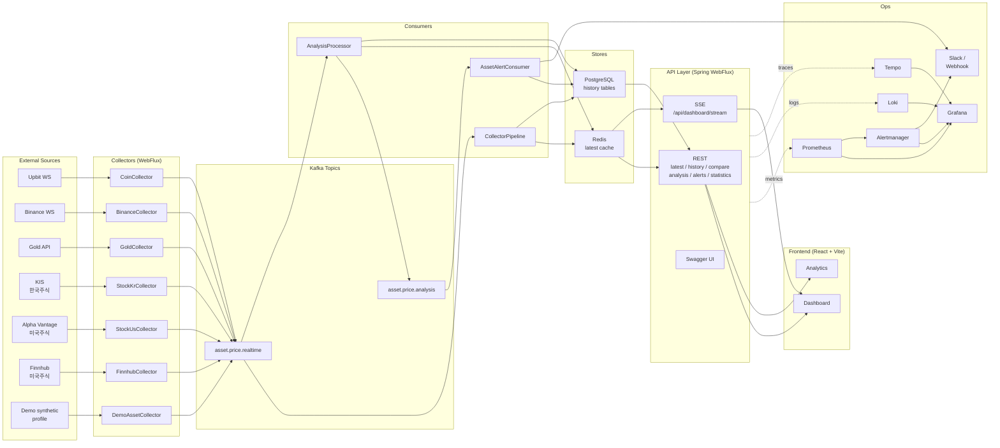
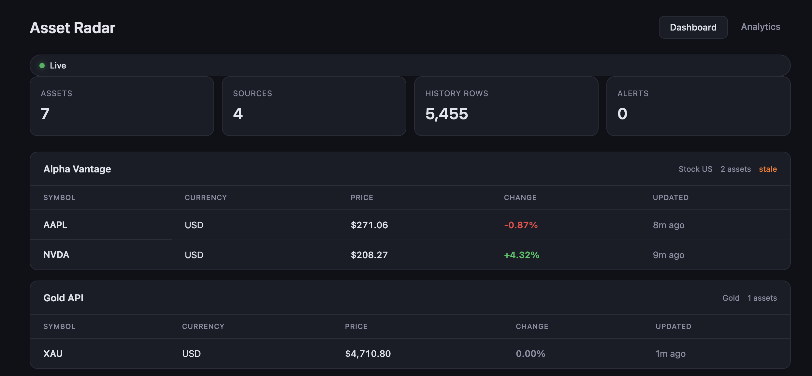
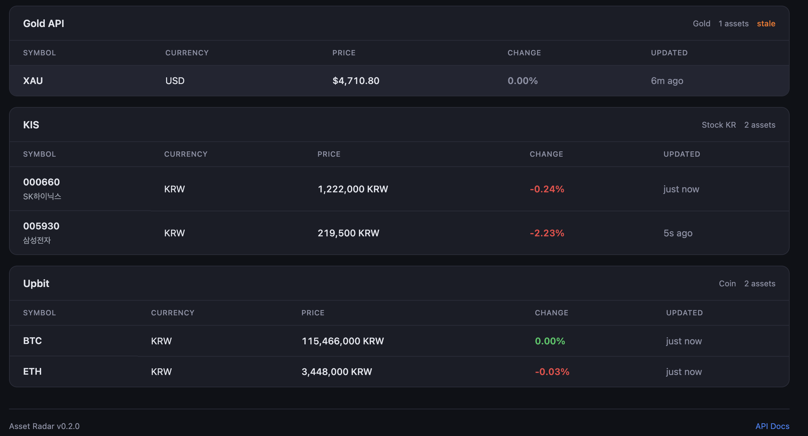
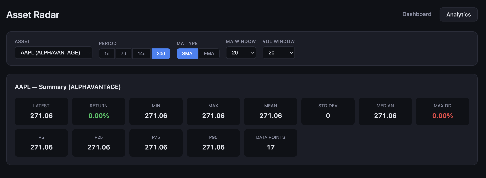

# asset-radar

`asset-radar`는 금, 코인, 한국 주식, 미국 주식 시세를 수집하고 Kafka 기반 파이프라인으로 분석/알림/조회 API까지 제공하는 실시간 자산 모니터링 프로젝트입니다.

## Architecture



수집 → Kafka → 처리/저장 → API → 화면이 단방향으로 흐르고, 운영 신호는 `Prometheus + Grafana + Loki + Tempo + Alertmanager` 스택으로 분리됩니다. 자세한 구조는 [`docs/architecture.md`](docs/architecture.md)를 참고하세요.

## Screenshots

### 실시간 대시보드
| Dashboard #1 | Dashboard #2 |
|--------------|--------------|
|  |  |

### 분석 화면


## 상태 스냅샷

기준일: 2026-05-17

- 현재 단계: 백엔드/프론트엔드/관측 스택은 동작 가능한 상태이며, 실행 환경을 `local`, `docker`, `demo`, `prod` 프로파일로 분리했다.
- 현재 워크트리 기준 포함 기능: 실시간 대시보드, 비교 API, 분석/알림 API, 통계 API, React 대시보드/애널리틱스 화면, API 키 없는 데모 데이터 흐름, Swagger 예시 응답, GHCR 기반 운영 배포 자동화
- 검증 결과: `./gradlew test` 통과. 프론트엔드 변경 시에는 `cd frontend && npm run lint`, `cd frontend && npm run test`, `cd frontend && npm run build`를 함께 수행한다.

## 기능별 체크리스트

### 데이터 수집

- [x] Upbit WebSocket 기반 코인 수집
- [x] Gold API 기반 금 시세 폴링
- [x] 한국투자증권(KIS) 기반 한국 주식 수집기
- [x] Alpha Vantage 기반 미국 주식 수집기
- [x] Binance WebSocket 연동 (`btcusdt`, `ethusdt`, 기본 비활성화)
- [x] Finnhub REST 연동 (US stocks, 기본 비활성화)
- [x] API 키 없이 실행 가능한 demo synthetic collector

### 파이프라인과 저장소

- [x] Spring Boot 3 + WebFlux 애플리케이션 골격
- [x] Kafka 기반 가격 이벤트 발행/소비
- [x] Redis 최신 시세/분석/알림 캐시
- [x] PostgreSQL 가격/분석/알림 이력 저장
- [x] R2DBC 기반 조회 리더 구현
- [x] Docker Compose 로컬 인프라 구성

### 분석과 알림

- [x] 자산 비교 수익률 계산
- [x] 최신 분석 결과 생성 및 조회
- [x] 알림 규칙 엔진과 severity 분류
- [x] Slack / Discord / Webhook 알림 확장 포인트
- [x] 통계 API: 이동평균, 변동성, 상관관계, 요약 통계
- [x] 포트폴리오 추천/전략화 로직

### API 제공 계층

- [x] `GET /api/dashboard`
- [x] `GET /api/dashboard/stream` SSE
- [x] `GET /api/latest`
- [x] `GET /api/history`
- [x] `GET /api/compare`
- [x] `GET /api/analysis`
- [x] `GET /api/analysis/history`
- [x] `GET /api/recommendations`
- [x] `GET /api/recommendations/symbol/{symbol}`
- [x] `GET /api/alerts`
- [x] `GET /api/alerts/history`
- [x] `GET /api/statistics/moving-average`
- [x] `GET /api/statistics/volatility`
- [x] `GET /api/statistics/correlation`
- [x] `GET /api/statistics/summary`
- [x] 공통 에러 응답 및 Swagger UI

### 프론트엔드

- [x] React + Vite 기반 SPA 분리
- [x] 실시간 Dashboard 화면
- [x] Analytics 화면과 차트 컴포넌트
- [x] Vite dev proxy와 Nginx 배포 이미지
- [x] ESLint 오류 정리
- [x] 프론트엔드 테스트 추가
- [x] 페이지/차트 번들 코드 스플리팅

### 운영과 품질

- [x] 로컬 observability stack (`Prometheus + Grafana + Loki + Tempo + Alertmanager`)
- [x] Spring profile 기반 환경 분리 (`local`, `docker`, `demo`, `prod`)
- [x] GitHub Actions CI
- [x] GitHub Actions 운영 배포 자동화
- [x] 배포 타깃별 secret 주입 방식 확정 (`.env.prod` 런타임 주입)
- [x] 백엔드 단위/웹/통합 테스트
- [x] 프론트엔드 lint/test/build를 포함한 CI 품질 게이트

## 실행

### 로컬 개발

인프라만 Docker로 띄우고 애플리케이션은 로컬에서 실행하는 방식입니다.

```bash
docker compose up -d kafka redis postgres prometheus grafana loki promtail tempo alertmanager
SPRING_PROFILES_ACTIVE=local ./gradlew bootRun
cd frontend
npm install
npm run dev
```

- 백엔드: `http://localhost:8080`
- 프론트엔드 개발 서버: `http://localhost:5173`
- Grafana: `http://localhost:3000`
- Prometheus: `http://localhost:9090`
- Loki: `http://localhost:3100`
- Tempo: `http://localhost:3200`
- Tempo OTLP: `grpc://localhost:4317`, `http://localhost:4318`
- Alertmanager: `http://localhost:9093`

로그는 `Promtail -> Loki`로 바로 수집되고, Prometheus alert rule은 Alertmanager까지 연결됩니다. Tempo는 OTLP 수집 엔드포인트까지 열어두었고, 애플리케이션 tracing exporter를 붙이면 Grafana에서 trace 조회까지 이어집니다.

### 실행 프로파일

| Profile | 용도 |
|---------|------|
| `local` | Kafka/Redis/PostgreSQL/관측 스택은 Docker, Spring Boot는 호스트에서 실행 |
| `docker` | 전체 컨테이너 실행. `docker-compose.yml`의 기본 앱 프로파일 |
| `demo` | 외부 API 수집기를 끄고 `DemoAssetCollector`가 합성 가격 데이터를 생성. `local,demo` 또는 `docker,demo`처럼 조합 |
| `prod` | 운영형 환경변수 기반 설정. 접속 정보와 tracing endpoint를 명시적으로 주입 |

API 키 없이 데이터 흐름을 확인하려면 다음처럼 실행합니다.

```bash
docker compose up -d kafka redis postgres prometheus grafana loki promtail tempo alertmanager
SPRING_PROFILES_ACTIVE=local,demo ./gradlew bootRun
```

알림 채널 설정 예시:

```yaml
asset-radar:
  alert:
    notifier:
      slack:
        enabled: true
        webhook-url: ${ASSET_RADAR_ALERT_SLACK_WEBHOOK_URL}
      discord:
        enabled: true
        webhook-url: ${ASSET_RADAR_ALERT_DISCORD_WEBHOOK_URL}
```

권장 운영 기준:

- Slack: `CRITICAL`만 전송
- Discord: `WARN` 이상 전송
- `INFO`: 외부 채널 전송 없이 API/대시보드/Grafana에서만 확인

### 전체 컨테이너 실행

```bash
docker compose up --build
```

- 백엔드: `http://localhost:8081`
- 프론트엔드: `http://localhost:3001`

API 키 없는 전체 컨테이너 데모는 다음 명령으로 실행합니다.

```bash
docker compose -f docker-compose.yml -f docker-compose.demo.yml up --build
```

### 운영 배포

운영 배포는 GitHub Actions가 API/프론트엔드 이미지를 GHCR에 푸시한 뒤, SSH로 운영 서버의 Docker Compose 스택을 갱신하는 방식입니다.

- 워크플로우: `.github/workflows/deploy.yml`
- 운영 compose: `deploy/docker-compose.prod.yml`
- secret 주입: 운영 서버의 `/opt/asset-radar/.env.prod` 런타임 환경변수
- 템플릿: `deploy/.env.prod.example`

애플리케이션 secret은 이미지 빌드나 GitHub Actions 환경에 넣지 않습니다. Actions에는 배포 전송에 필요한 `PROD_SSH_*` 값과, GHCR package가 private일 때만 `GHCR_USERNAME`, `GHCR_TOKEN`을 둡니다. KIS, Alpha Vantage, Finnhub, 알림 webhook, DB 비밀번호는 운영 서버의 `.env.prod`에서만 관리합니다.

```bash
ssh "$PROD_SSH_USER@$PROD_SSH_HOST" 'sudo mkdir -p /opt/asset-radar && sudo chown "$USER" /opt/asset-radar'
scp deploy/.env.prod.example "$PROD_SSH_USER@$PROD_SSH_HOST:/opt/asset-radar/.env.prod"
ssh "$PROD_SSH_USER@$PROD_SSH_HOST" 'vi /opt/asset-radar/.env.prod'
```

상세 절차는 [`deploy/README.md`](deploy/README.md)를 참고하세요.

## 주요 API

### 실시간 대시보드

```http
GET /api/dashboard
GET /api/dashboard/stream
```

### 시세/이력 조회

```http
GET /api/latest?source=UPBIT&quoteCurrency=KRW
GET /api/history?symbol=BTC&source=UPBIT&quoteCurrency=KRW&limit=100
```

### 자산 비교

```http
GET /api/compare?assets=UPBIT:KRW:BTC,GOLDAPI:USD:XAU&period=30d&baseAmount=1000000
```

비교 규칙:

- `assets`는 `SYMBOL` 또는 `SOURCE:QUOTE:SYMBOL` 형식을 받습니다.
- `period`는 `30d`, `12h`, `15m` 같은 형식을 받습니다.
- 서로 다른 `quoteCurrency`가 섞이면 `projectedValueComparable=false`가 되고 `projectedValue`는 `null`로 내려갑니다.

### 분석/알림

```http
GET /api/analysis?source=UPBIT&quoteCurrency=KRW
GET /api/analysis/history?symbol=BTC&source=UPBIT&quoteCurrency=KRW&limit=30
GET /api/alerts?limit=10
GET /api/alerts/history?symbol=BTC&source=UPBIT&quoteCurrency=KRW&limit=30
```

### 통계

```http
GET /api/statistics/moving-average?symbol=BTC&source=UPBIT&period=30d&type=SMA&window=20
GET /api/statistics/volatility?symbol=BTC&source=UPBIT&period=30d&window=20
GET /api/statistics/correlation?assets=UPBIT:KRW:BTC&assets=UPBIT:KRW:ETH&period=30d
GET /api/statistics/summary?symbol=BTC&source=UPBIT&period=30d
```

### 포트폴리오 추천

```http
GET /api/recommendations
GET /api/recommendations?source=UPBIT&quoteCurrency=KRW
GET /api/recommendations/symbol/{symbol}
```

최신 분석 데이터에 기반하여 각 자산에 대한 종합 추천 액션(STRONG_BUY ~ STRONG_SELL)을 생성합니다.

**추천 전략:**

- **Momentum Strategy**: 현재 추세와 변화율 기반 단기 추천
- **Mean Reversion Strategy**: 극단적 변화가 평균으로 복귀할 것이라는 가설 기반

각 전략의 가중치를 적용하여 최종 추천을 결정하고, 신뢰도(confidence) 점수와 근거(reasons)를 함께 제공합니다.

응답 예시:

```json
{
  "recommendations": [
    {
      "symbol": "BTC",
      "action": "BUY",
      "actionLabel": "매수",
      "confidence": 0.72,
      "confidenceLevel": "medium",
      "reasons": [
        "현재 가격: 42500.50 (변화율: 5.20%, 움직임: UP)",
        "Momentum Strategy: 매수 (신뢰도: 80%)",
        "Mean Reversion Strategy: 보유 (신뢰도: 60%)"
      ],
      "analyzedAt": "2026-05-02T10:15:00"
    }
  ],
  "totalCount": 1,
  "analyzedAt": "2026-05-02T10:15:00"
}
```

## 문서

- `docs/architecture.md`
- `docs/data-sources.md`
- `docs/decision-log.md`
- `deploy/README.md`
- `PROJECT_PLAN.md`
- `frontend/README.md`

## 현재 남은 작업

- Grafana 운영 대시보드 스크린샷과 장애 진단 runbook 보강
